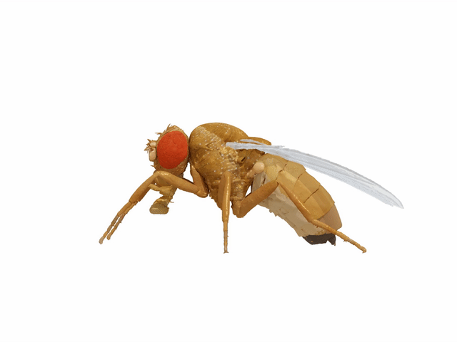

# NeuroMechFly
[](https://opensource.org/licenses/Apache-2.0) 
[](https://badge.fury.io/gh/tterb%2FHyde)

<p align="center">
  
</p>

**NeuroMechFly** is a data-driven computational simulation of adult *Drosophila melanogaster* designed to synthesize rapidly growing experimental datasets and to test theories of neuromechanical behavioral control. For the technical background and details, please refer to our [paper](https://www.biorxiv.org/content/10.1101/2021.04.17.440214v1).

If you use NeuroMechFly in your research, you can cite us:

```Latex
@article {Lobato-Rios2021.04.17.440214,
	author = {Lobato-Rios, Victor and {\"O}zdil, Pembe Gizem and Ramalingasetty, Shravan Tata and Arreguit, Jonathan and Clerc Rosset, St{\'e}phanie and Knott, Graham and Ijspeert, Auke Jan and Ramdya, Pavan},
	title = {NeuroMechFly, a neuromechanical model of adult Drosophila melanogaster},
	elocation-id = {2021.04.17.440214},
	year = {2021},
	doi = {10.1101/2021.04.17.440214},
	publisher = {Cold Spring Harbor Laboratory},
	URL = {https://www.biorxiv.org/content/early/2021/04/18/2021.04.17.440214},
	eprint = {https://www.biorxiv.org/content/early/2021/04/18/2021.04.17.440214.full.pdf},
	journal = {bioRxiv}
}
```

## Content

- [Starting](#starting)
- [Reproducing the experiments](#reproducing-the-experiments)
- [Miscellaneous](#miscellaneous)


## Starting
* [Installation](docs/installation.md)
* [Angle Processing](docs/angleprocessing.md)

## Replicating our results 
**Note:** before running the following scripts, please be sure to activate the virtual environment (see the [installation guide](docs/installation.md))

NeuroMechFly is run in [PyBullet](https://github.com/bulletphysics/bullet3/tree/master/examples/pybullet). In the Graphical User Interface, you can use the following keyboard and mouse combinations to control the camera's viewpoint:
- ALT/CONTROL & Left Mouse Button: Rotate
- ALT/CONTROL & Scroll Mouse Button: Pan
- Scroll Mouse Button: Zoom

**1. Kinematic replay**
<p align="center">
  
  
</p>

Run the following commands on the terminal to reproduce the kinematic replay experiments:
- ```$ run_kinematic_replay --behavior walking```  for locomotion on the spherical treadmill. To simulate foreleg/antennal grooming, change ```walking``` at the end of the command to ```grooming```. 
**Note:** Locomotion begins ~2.5 seconds into the simulation. Until then, the fly stands still. 

- ```$ run_kinematic_replay_ground --perturbation``` to simulate locomotion on the ground with perturbations enabled. Remove ```--perturbation``` to disable perturbations. To change the behavior to grooming, append ```--behavior grooming``` to the command.

<p align="center">
  
</p>

**NOTE:** At the end of each simulation run, a folder called *kinematic_replay_<behavior>_<time-stamp>* containing the physical quantities (joint angles, torques etc.) will be created under the *scripts/kinematic_replay* folder.

**NOTE:** To obtain new pose estimates from the [DeepFly3D Database](https://dataverse.harvard.edu/dataverse/DeepFly3D), please refer to [DeepFly3D repository](https://github.com/NeLy-EPFL/DeepFly3D). After running the pose estimator on the recordings, you can follow the instructions for computing joint angles to control NeuroMechFly [here.](https://github.com/NeLy-EPFL/NeuroMechFly/blob/km-refactor/docs/angleprocessing.md)

---

**2. Gait optimization** 

<p align="center">
  
</p>

Run the following commands on the terminal to reproduce the locomotor gait optimization experiments:
- ```$ run_neuromuscular_control``` to run the latest generation of the last optimization run. By default, this script will read and run the files *FUN.txt* and *VAR.txt* under the *scripts/neuromuscular_optimization/* folder. To run different files, simply run ```$ run_neuromuscular_control -p <'path-of-the-optimization-results'> -g <'generation-number'> -s <'solution-type'>``` (solution type being fastest, medium, slowest, or a specific index). **The results path should be relative to the *scripts* folder.** To see the results that are already provided, go to the folder *scripts/neuromuscular_optimization/* and run: ```$ run_neuromuscular_control  -p optimization_results/run_Drosophila_example/ -g 50```.

**NOTE:** At the end of each simulation run, a folder named according to the chosen optimization run will be created under the *scripts/neuromuscular_optimization* folder which contains the network parameters and physical quantities.

- ```$ run_multiobj_optimization``` to run locomotor gait optimization from scratch. This script will create new files named *FUN.txt* and *VAR.txt* as well as a new folder containing the results from each generation in a folder named *optimization_results*. After optimization has completed, run ```$ run_neuromuscular_control``` to visualize the results from the last generation. To see different generations, follow the instructions above and select a different file. 

**NOTE:** Optimization results will be stored under *scripts/neuromuscular_optimization/optimization_results* inside a folder named according to the chosen optimization run.

**NOTE:** The code and results in this repository are improved compared with the results in our original [paper](https://www.biorxiv.org/content/10.1101/2021.04.17.440214v1). 

**NOTE:** To formulate new objective functions and penalties, please refer to the *NeuroMechFly/experiments/network_optimization*. 

---

**3. Sensitivity Analysis** 

- First, download the simulation data pertaining to the sensitivity analyses from [here](https://drive.google.com/drive/folders/1H0G3mdeKLyGkS1DYxbOeOCXgywJmwfs9?usp=sharing) and place these files in the folder, *data/sensitivity_analysis*
- To reproduce the sensitivity analysis figures, ```$ run_sensitivity_analysis```. Make sure that the downloaded files are in the correct location. 

## Miscellaneous

**1. Central Pattern Generator Controller**
- To see the CPG network, navigate to *data/locomotion_network/* and run ```$ python locomotion.py```
- Please refer to [FARMS Network](https://gitlab.com/farmsim/farms_network) to learn more about how to design new neural network controllers.

---

**2. Blender Model**
- To visualize the biomechanical model, first install [Blender](https://www.blender.org/download/). 
- After installation, navigate to *data/design/blender* and open ```neuromechfly_full_model.blend``` with Blender. 

---

**3. Reproducing the Figures**
-  All of the plotting functions used in the paper can be found in [*NeuroMechFly/utils/plotting.py*](NeuroMechFly/utils/plotting.py). Please refer to the docstrings provided in the code for the details about how to plot your simulation data.
-  For example, for reproducing plots on Fig. 5 and 6 panel E, first, run the script *run_kinematic_replay* or *run_kinematic_replay_ground*, and then use:
```python
from NeuroMechFly.utils import plotting
import pickle

path_data = /path/to/kinematic/replay/results/folder

# Selecting right front leg for plotting (other options are LF, RM, LM, LH, or RH)
leg = 'RF'

# Read angles from file
with open(path/to/angles, 'rb') as f:
    angles = pickle.load(f)
    
# Defining time limits for the plot (seconds)
start_time = 3.5 # 0.5 for grooming
stop_time = 4.6 # 2.5 for grooming

plotting.plot_data(path_data, 
		   leg,
		   angles=angles,
		   plot_angles=True,
		   plot_torques=True,
		   plot_grf=True,
		   plot_collisions=True, # For grooming example
		   collisions_across=True,
		   begin=start_time,
		   end=stop_time)
```

- For reproducing gait/collision diagrams from Fig. 5 and 6, first, run the script *run_kinematic_replay* or *run_kinematic_replay_ground*, and then use:
```python
from NeuroMechFly.utils import plotting

path_data = /path/to/kinematic/replay/results/folder

# Selecting walking behavior
behavior = 'walking'

# Defining time limits for the plot (seconds)
start_time = 3.5 # 0.5 for grooming
stop_time = 4.6 # 2.5 for grooming

plotting.plot_collision_diagram(path_data, 
		                behavior,
		                begin=start_time,
		                end=stop_time)
				
```

- For reproducing plots from Fig. 7 panel E, first, run the script *run_neuromuscular_control*, and then use:
```python
from NeuroMechFly.utils import plotting

path_data = /path/to/neuromuscular/control/results/folder

# Selecting right front leg for plotting (other options are LF, RM, LM, LH, or RH)
leg = 'RF'

# Defining time limits for the plot (seconds)
start_time = 1.0
stop_time = 1.5

plotting.plot_data(path_data, 
		   leg,
		   plot_angles=False,
		   plot_torques=False,
		   plot_grf=False,
		   collisions_across=False,
		   plot_muscles_act=True,
		   plot_torques_muscles=True,
		   plot_angles_sim=True,
		   begin=start_time,
		   end=stop_time)				
```
---

## License
[Apache 2.0](https://www.apache.org/licenses/LICENSE-2.0)
