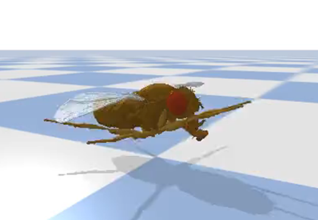

# Biomechanical module

Links and joints are defined in the ```sdf``` configuration files located in ```data/design/sdf/```. For a complete guide to the simulation description format (sdf) please refer to its [main page](http://sdformat.org/).

In this tutorial you can learn how to:
- [Modify body segments](#modifying-the-body-segments)
- [Modify joints](#modifying-joints)
- [Change the pose](#changing-the-pose)


## Modifying body segments

Each body segment in the biomechanical model is called a link. Each link is defined in the sdf configuration file with respect to its physical properties including: *pose, inertia, collision shape, and visual shape*. All of these properties were obtained from the rendered CT-scan model. *pose* consists of the translation and orientation of each link. *inertia* defines the mass and inertial moments. *collision* and *visual* shapes are the meshes rendered from the CT-scan model. Modifying the *pose* or *inertial* values for any link directly on the sdf file can lead to unstable simulations. Therefore we do not recommend it.

**Changing visual/collision shape**

On the other hand, changing the *visual* and *collision* shapes is fairly easy and keeps the mass and intertial measurements untouched. To change these shapes, you must change the ```geometry``` definition in the ```collision``` and ```visual``` attributes for the link. We performed such an operation in our [publication](https://www.biorxiv.org/content/10.1101/2021.04.17.440214v2) to change the morphology of NeuroMechfly's detailed antennae into sticks.

<table>
<tr>
<th>NeuroMechFly model</th>
<th>Antenna stick model</th>
</tr>
<tr>
<td>
  
```html
<collision name="LAntenna_collision">
  <pose>0.0 0.0 0.0 0.0 0.0 0.0</pose>
  <geometry>
    <mesh>
      <uri>../meshes/stl/LAntenna.stl</uri>
      <scale>1000.0 1000.0 1000.0</scale>
    </mesh>
  </geometry>
</collision>
<visual name="LAntenna_visual">
  <pose>0.0 0.0 0.0 0.0 0.0 0.0</pose>
  <geometry>
    <mesh>
      <uri>../meshes/stl/LAntenna.stl</uri>
      <scale>1000.0 1000.0 1000.0</scale>
    </mesh>
  </geometry>
  <material/>
</visual>
```
  
</td>
<td>
  
```html
<collision name="LAntenna_collision">
  <pose>0.0 0.0 -0.1485 0 0 0</pose>
  <geometry>
    <cylinder>
      <radius>0.06</radius>
      <length>0.297</length>
    </cylinder>
  </geometry>
</collision>
<visual name="LAntenna_visual">
  <pose>0.0 0.0 -0.1485 0 0 0</pose>
  <geometry>
    <cylinder>
      <radius>0.06</radius>
      <length>0.297</length>
    </cylinder>
  </geometry>
  <material/>
</visual>
```

</td>
</tr>
</table>

## Modifying joints

NeuroMechFly has 90 defined joints (degrees-of-freedom). These are listed in Table 3 of our related [publication](https://www.biorxiv.org/content/10.1101/2021.04.17.440214v2). 
In every sdf configuration file, the joints are defined as follows:

```html
<joint name="joint_name" type="revolute">
  <parent>parent_link_name</parent>
  <child>child_link_name</child>
  <pose>0.0 0.0 0.0 0.0 0.0 0.0</pose>
  <axis>
    <xyz>0.0 0.0 1.0</xyz>
    <limit>
      <lower>-3.14</lower>
      <upper>3.14</upper>
    </limit>
  </axis>
</joint>
```

**Removing joints**

Intuitively, one can imagine that removing a joint's definition will simply stop its use. However, such an operation can also affect other attributes. NeuroMechFly's biomechanical model is built as a kinematic chain. Therefore, any change to a joint will affect all of the links below it in the chain. Thus, you should be sure to conserve a valid kinematic chain after completely removing a joint. Alternatively, you can remove the actuation of a joint by setting its ```type``` variable to *fixed*. This will keep the joint static and in its zero pose. Furthermore, you can refer to the [changing pose section](#changing-the-pose) below to know how to fix a position (apart from the zero pose) during simulations.

**Adding joints**

To add a new joint, you can copy the snippet above and replace the variables ```"joint_name"```, ```parent_link_name```, and ```child_link_name``` at your convenience. This will generate a hinge-type (revolute) joint between the *parent* and the *child* links rotating around the *z* axis without limits. However, adding a joint implies also updating the ```parent_link_name```, and ```child_link_name``` variables in the *parent* and *child* links to preserve the kinematic chain.

**Modifying the range of motion**

You can specify the range of motion for any joint by changing its ```lower``` and ```upper``` values in the ```limit``` property. For example, the following lines would set the joint limits for the Tibia-Tarsus joint in the left front leg to +/- 90° with respect to its zero-pose.

```html
<joint name="joint_LFTarsus1" type="revolute">
  <parent>LFTibia</parent>
  <child>LFTarsus1</child>
  <pose>0.0 0.0 0.0 0.0 0.0 0.0</pose>
  <axis>
    <xyz>0.0 1.0 0.0</xyz>
    <limit>
      <lower>-1.57</lower>
      <upper>1.57</upper>
    </limit>
  </axis>
</joint>
```

## Changing the pose

Poses are defined in ```data/config/pose``` as *yaml* files. They consist of a list of joints with their desired angles in degrees. If a joint is not modified here, it will retain its zero pose. For example, the following lines generate a *stretched pose*.

<table>
<tr>
<th>Stretched pose definition</th>
<th>Stretched pose</th>
</tr>
<tr>
<td>
  
```html
joints:
  joint_LFCoxa: 19
  joint_LFFemur: -130
  
  joint_LMCoxa_roll: 90
  joint_LMFemur: -100
  
  joint_LHCoxa_roll: 150
  joint_LHFemur: -100
  
  joint_RFCoxa: 19
  joint_RFFemur: -130
  
  joint_RMCoxa_roll: -90
  joint_RMFemur: -100
  
  joint_RHCoxa_roll: -150
  joint_RHFemur: -100
```
  
</td>
<td>
  
<p align="center">
  
</p>

</td>
</tr>
</table>

**Initial pose**

Initial poses are the poses applied to the simulation in the first time step. They are used to avoid unwanted collisions when the model is created.
If no initial pose is defined for a simulation, it will use the zero pose from the model. This is shown in Fig. S7 of our related [publication](https://www.biorxiv.org/content/10.1101/2021.04.17.440214v2). For example, we use the stretch pose (shown above) when running the script ```run_kinematic_replay_ground``` to avoid collisions with the floor prior to the start of the simulation. We add this pose as the ```pose``` variable in the simulation options. Please refer to the [environment tutorial](environment_tutorial.md) to learn how to incorporate an initial pose into your simulation.

**Resting pose during simulation**

The resting pose applies to joints that should maintain a certain position over the course of the entire simulation. If the zero pose of a segment is the desired resting pose, then we recommend defining that joint as *fixed* (as explaned above in the *Removing joints* subsection). This is particularly useful in optimization experiments to reduce compute. However, if you want to use a non-zero pose, then you must actuate joints to maintain a desired angle for each time step. We used a resting pose for many non-leg segments during our *kinematic replay* experiments. These joints are defined in a dictionary named ```fixed_positions``` and defined as the ```fixed_positions``` variable in the simulation initialization. Please refer to the [environment tutorial](environment_tutorial.md) to learn how to incorporate fixed positions into your simulation.

